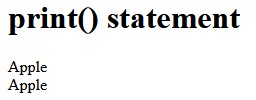
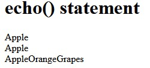
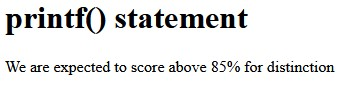
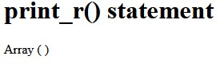
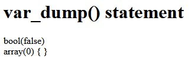

# PHP | Print statements

This is an example of many forms that print statements.

Deployed by **[jlammx](https://github.com/jlammx)**
- 🚀 Live: [View deployment](http://demo.pagos.cafisa.org/php_print_statements)

<br/>

In PHP there are various methods to print data. PHP provides more functions and language constructs for printing various data types. These functions are varied on the data format printed on the browser using them.

For example, the print() and echo() statements print string data, whereas, the print_r() is used to print compound datatype-like arrays or objects.


## PHP Functions used for printing data

### print() statement

The print() is used to create a PHP print statement to print given data to the browser. It accepts single data and prints it on the browser.

It is a PHP language construct and not a function. So, we can use ‘print’ without parenthesis for creating a print statement. The code shows an example for using print with and without parenthesis where both will print the same data.

```php
<?php
    print "Apple";
    // (or)
    print("Apple");
?>
```
<p align="left">
	
</p>


### echo() statement

```php
<?php
    echo "Apple";
    // (or)
    echo ("Apple");

    // Output AppleOrangeGrapes
    echo "Apple", "Orange", "Grapes";
    // not a valid statement
    echo ("Apple","Orange","Grapes");
?>
```
<p align="left">
	
</p>


### printf(string_format, values) statement

This method is used to print the formatted output by using the values passed as the parameter of this function. So, this function accepts the output string format and the values to be added.

```php
<?php
    printf('We are expected to score above %d%% for distinction', 85);
    // Output: We are expected to score above 85%
    // for distinction
?>
```
<p align="left">
	
</p>


### sprintf() statement

This is similar to the printf() function except that it can return the formatted string instead of printing it to the browser. Then we can store it into a variable.


### print_r() statement

This function is used to print the compound data like PHP array or objects.

```php
<?php
    print_r($_FILES); // returns array
    print_r(false); // returns empty string
?>
```
<p align="left">
	
</p>


### var_dump() statement
var_dump() also prints array data in structured manner. It gives additional data, like, the data type, the length, values and more.

```php
<?php
    var_dump(false); // prints bool(false)
    var_dump($_FILES); // prints array
?>
```
<p align="left">
	
</p>


### Skills
<p align="left">
	<a href="https://dart.dev" target="_blank">
		
	</a> 
</p>

<br/>

<p align="center">
	<div align="center" inline>
		<span> <a href="https://www.linkedin.com/in/jlammx/" target="_blank">
			</a>
		</span>
		&nbsp;&nbsp;&nbsp;&nbsp;
	</div>
</p>

<p align="center"> Last updated at 10 Mar 2023</p>
